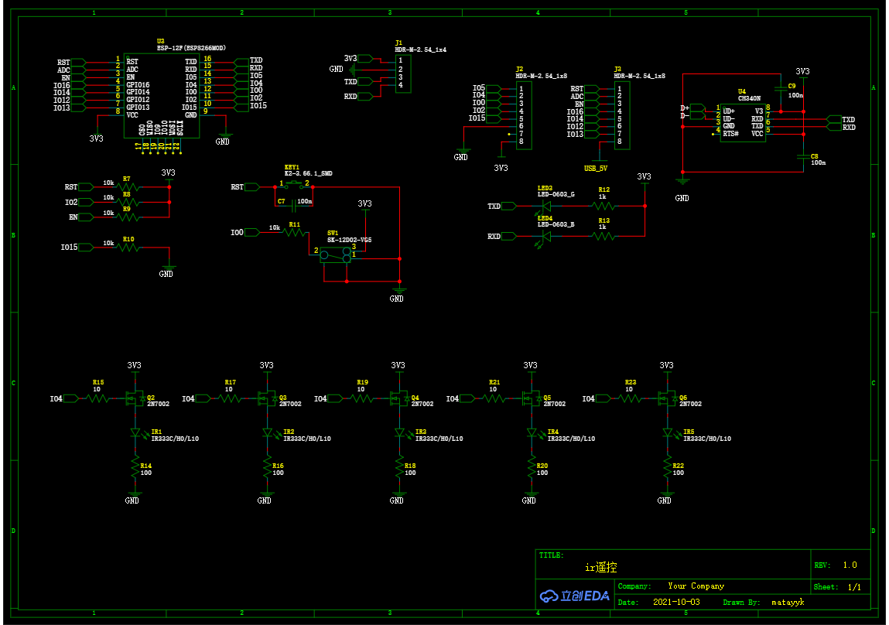
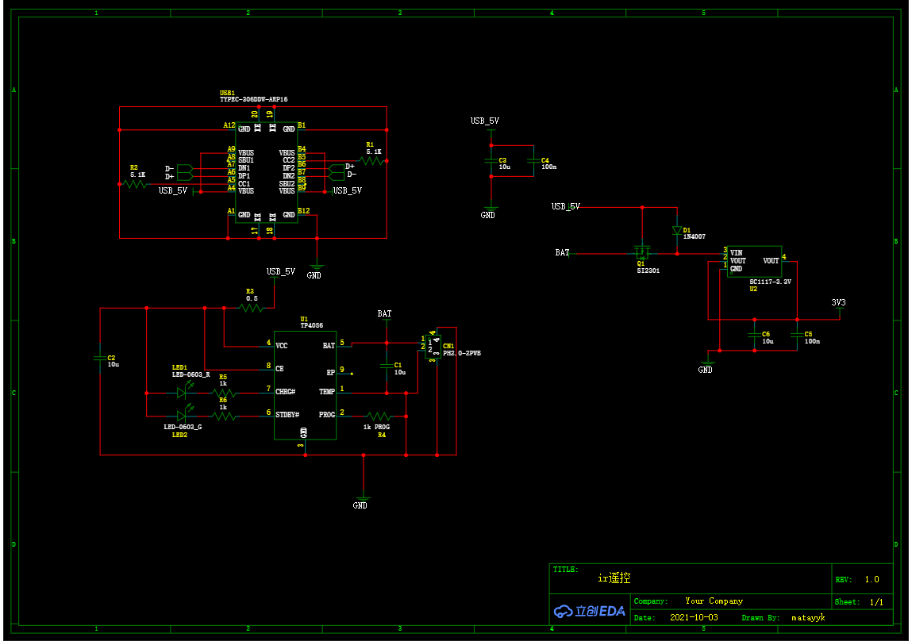

# 基于 ESP8266_RTOS_SDK 和 IRext 的红外遥控器
## 链接

* [ESP8266_RTOS_SDK](https://github.com/espressif/ESP8266_RTOS_SDK)
* [IRext](https://cc.irext.net/)

## 简介
通过MQTT向8266设备发送控制码，再由IRext提供的红外解码库解码，控制红外设备发送

